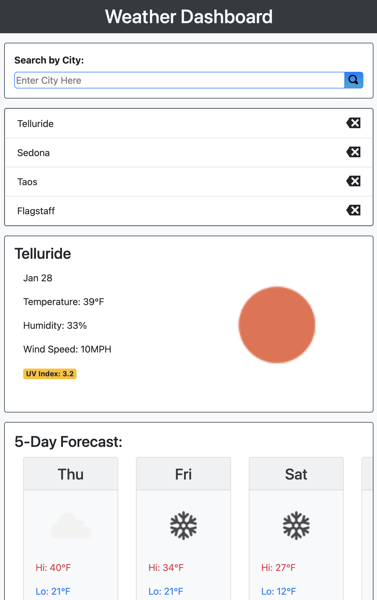

# Weather App

## Links
- [Deployed Application](https://matt-gross-27.github.io/weather/)
- [Weather API](https://openweathermap.org/api)
- [Github Repo](https://github.com/matt-gross-27/weather)

## Layout

## Features
- Search a city to view weather information
  - Current weather
  - Five day forecast
- Search history saved to local storage
- Search history can be clicked (to view weather), sorted and deleted
- UV index color coded [EPA UV Index Scale](https://www.epa.gov/sunsafety/uv-index-scale-0)